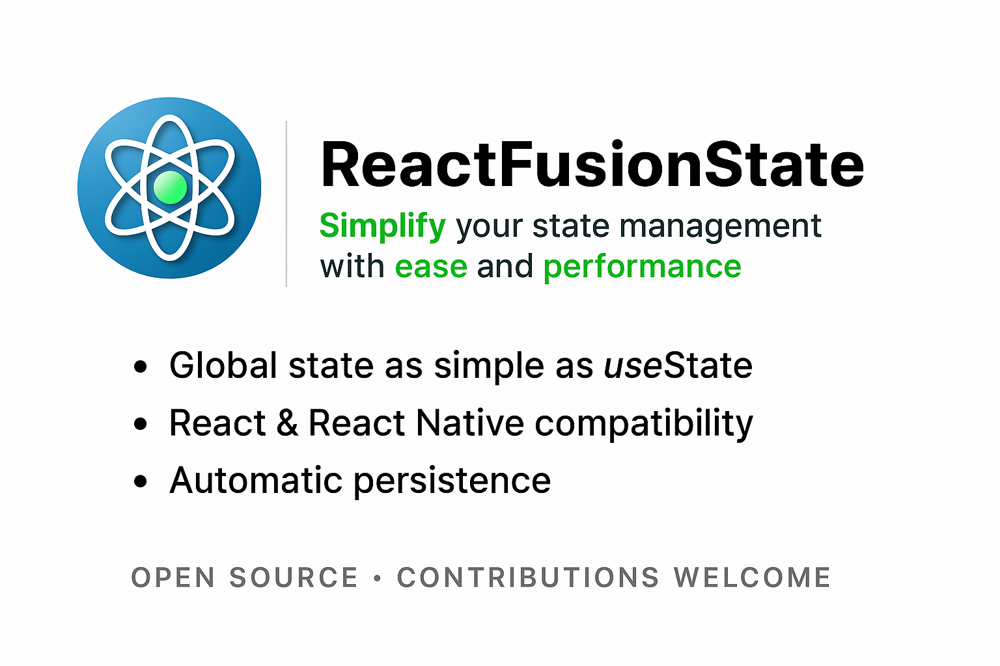

**ReactFusionState** is a global state management library for React and React Native applications, designed to be simple and efficient.
It allows you to create and manage global states without the need for atoms, similar to RecoilState but more streamlined.

## Installation

To install **ReactFusionState**, use **npm** or **yarn**:

```bash
npm install react-fusion-state
```

or

```bash
yarn add react-fusion-state
```

## Usage

**1. FusionStateProvider**

The **FusionStateProvider** component is used to provide the global state context to your React application.

**Props**:

- **children: ReactNode** - The child components that will have access to the global state.

**Example**:

```bash
import React from "react";
import { FusionStateProvider } from "react-fusion-state";
import App from "./App";

const Root = () => (
  <FusionStateProvider>
    <App />
  </FusionStateProvider>
);

export default Root;
```

**2. useFusionState**

The **useFusionState** hook is used to create and manage a global state.

**Prototype**:

```bash
const useFusionState = <T,>(key: string, initialValue?: T): [T, React.Dispatch<React.SetStateAction<T>>];
```

**Parameters**:

- **key: string** - The unique key for the state.
- **initialValue?: T** - The initial value for the state. If not provided and the key does not exist, an error will be thrown.

Returns:

- **[T, React.Dispatch<React.SetStateAction<T>>]** - An array containing the state and a function to update the state.

**Example**:

```bash
import React from 'react';
import { useFusionState } from 'react-fusion-state';

const CounterComponent: React.FC = () => {
  const [count, setCount] = useFusionState<number>('count', 0);

  return (
    <div>
      <p>Count: {count}</p>
      <button onClick={() => setCount(count + 1)}>Increment</button>
      <button onClick={() => setCount(count - 1)}>Decrement</button>
    </div>
  );
};

export default CounterComponent;
```

**3. useFusionStateLog**

The **useFusionStateLog** hook is used to retrieve the global state.

Prototype:

```bash
const useFusionStateLog = (keys?: string[]): any;
```

Parameters:

- **keys?: string[]** - An optional array of keys to retrieve specific states. If not provided, all states will be returned.

**Returns**:

- **any** - The global state or the specified states.

**Example**:

```bash
import React from 'react';
import { useFusionStateLog } from 'react-fusion-state';

const StateViewer: React.FC = () => {
  const allState = useFusionStateLog();
  const specificState = useFusionStateLog(['count', 'nonExistentKey']);

  return (
    <div>
      <div>
        <h3>All State</h3>
        <pre>{JSON.stringify(allState, null, 2)}</pre>
      </div>
      <div>
        <h3>Specific State</h3>
        <pre>{JSON.stringify(specificState, null, 2)}</pre>
      </div>
    </div>
  );
};

export default StateViewer;
```

## Complete Example

Here is a complete example of how to use **ReactFusionState** in a React application, including accessing the global state in a different component.

**App.tsx**:

```bash
import React from 'react';
import { useFusionState, useFusionStateLog } from 'react-fusion-state';

const CounterComponent: React.FC = () => {
  const [count, setCount] = useFusionState<number>('count', 0);

  return (
    <div>
      <p>Count: {count}</p>
      <button onClick={() => setCount(count + 1)}>Increment</button>
      <button onClick={() => setCount(count - 1)}>Decrement</button>
    </div>
  );
};

const AnotherComponent: React.FC = () => {
  const [count, setCount] = useFusionState<number>('count');

  return (
    <div>
      <p>Count in AnotherComponent: {count}</p>
      <button onClick={() => setCount(count + 1)}>Increment</button>
      <button onClick={() => setCount(count - 1)}>Decrement</button>
    </div>
  );
};

const StateViewer: React.FC = () => {
  const allState = useFusionStateLog();
  const specificState = useFusionStateLog(['count', 'count2', 'nonExistentKey']);

  return (
    <div>
      <div>
        <h3>All State</h3>
        <pre>{JSON.stringify(allState, null, 2)}</pre>
      </div>
      <div>
        <h3>Specific State</h3>
        <pre>{JSON.stringify(specificState, null, 2)}</pre>
      </div>
    </div>
  );
};

const App: React.FC = () => (
  <div>
    <CounterComponent />
    <AnotherComponent />
    <StateViewer />
  </div>
);

export default App;
```

**index.tsx**:

```bash
import React from 'react';
import ReactDOM from 'react-dom';
import { FusionStateProvider } from 'react-fusion-state';
import App from './App';

ReactDOM.render(
  <FusionStateProvider>
    <App />
  </FusionStateProvider>,
  document.getElementById('root')
);
```

## Bugs

If you find a bug, please post it as a new issue on the **GitHub** repository.

## Contribute

Would like to contribute to the project ?
Fork the **ReactFusionState** project, include your changes, and submit a pull request back to the main repository.

## License

This project is licensed under the **MIT License**.

## Author

This project is maintained by [Jacques GERARD](https://www.linkedin.com/in/jgerard/)
